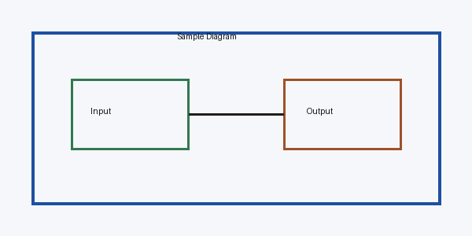

# sample_pdf

# Page 1

Technical   Manual

## 1. Overview

This PDF contains sample text, a simple table, and a diagram image.

Parameter      Value Description

WAIT_TIME      15   Wait time in seconds

SHORT_PATH_RATE 70  Short path rate percentage

## 2. Diagram

# Extracted Images

---

## Conversion Notes

- PDF heading detection uses heuristic rules and requires manual review.
- Scanned PDFs are not supported in this MVP because OCR is not enabled.
- Complex PDF tables, merged cells, and multi-column layout may require manual review.
