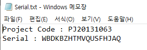
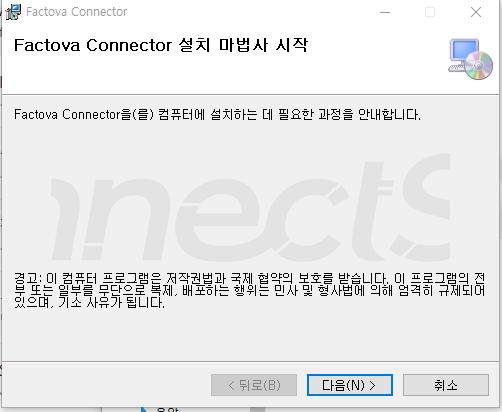
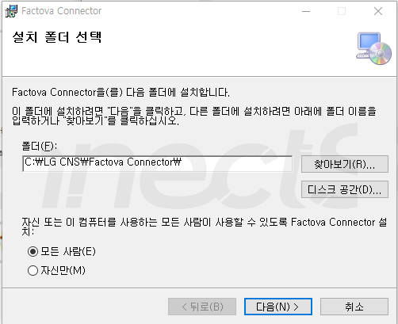
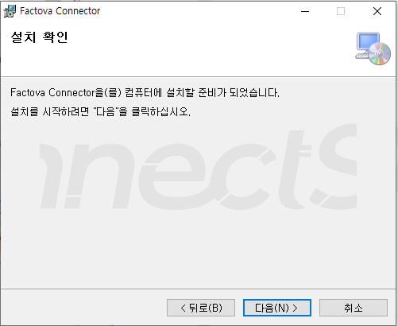
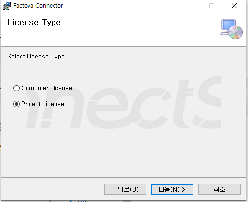
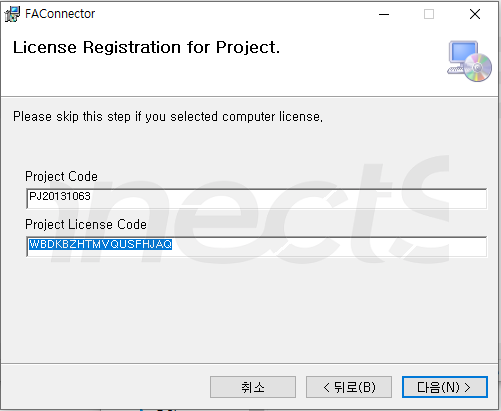
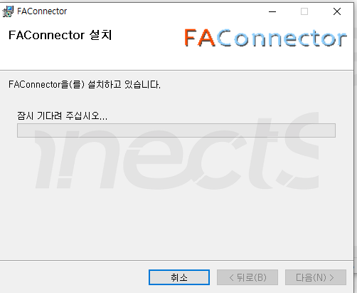
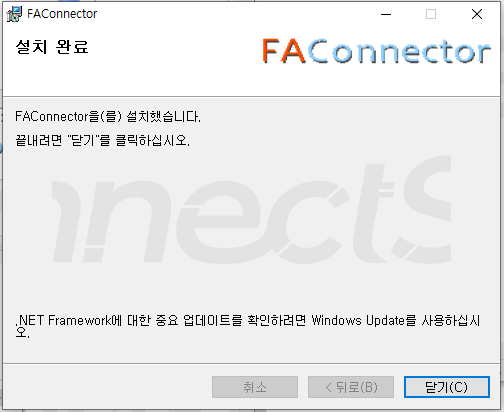
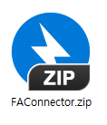

# sample_pptx

# Slide 1: CNVC User Manual

| Project Name |  | CNVC |
| --- | --- | --- |
| System - Features |  |  |
| Methodology | Stage |  |
|  | Step |  |
| Document Number |  |  |

| Win In | PL | QA | PM | Customer |
| --- | --- | --- | --- | --- |
|  |  |  |  |  |

# Slide 2: Revision History

| Version | Revision Date | Amendments |  |  | Author | Approver |
| --- | --- | --- | --- | --- | --- | --- |
|  |  | Part | Page | Type: Explanation (Before->After) |  |  |
| 1.0 | 2023.09.08 |  |  | Revision | Lee Seung-wook |  |
|  | 24/3/27 |  |  | Add "Control Belt Move Permit" parameter | Lee Seung-wook |  |
|  | 24/7/3 |  |  | Add instructions for setting and applying parameters | Park Si-hyung |  |
|  | 24/7/30 |  |  | Adding Parameter Settings and Modifying Modeling Methods | Park Si-hyung |  |
|  | 24/9/13 |  |  | Add Parameter Settings | Jeong Min-seok |  |
|  |  |  |  |  |  |  |
|  |  |  |  |  |  |  |
|  |  |  |  |  |  |  |
|  |  |  |  |  |  |  |
|  |  |  |  |  |  |  |

# Slide 3: List

- List

- 1. How to Install the CNVC Essential Program ...........................................................  4

- 2. How to Run the CNVC Program and Apply Patches .........................................................  6

- 3. Description of CNVC Features and Units  ............................................................... 12

- 4. Troubleshooting Procedures  .................................................................... 34

- 5. Special Scenarios, Parameter Settings, and Application Methods  .............................................. 53

- 6. RemoteView (Remote Access) Settings and Description...................................................................... 94

- 7. LGCNS.ezControl.Modeler Modeling Method ......................................................... 96

- 8. How to Use the UI Modeler................................................................... 101

# Slide 4: 2. CNVC CIM Setup

- 2. CNVC CIM Setup

- 1. Installing the CNVC CIM Software

- Extract the CNV CIM archive from the deployment file

- 2. Installing the Factova Connector

  - Unzip the FAConnector.zip file from the distribution package -> Run the FAConnectorSetup.msi file -> Follow the steps shown in the figure below (※Serial number required!!)

---

## Conversion Notes

- PowerPoint SmartArt and complex diagrams may be extracted as images or skipped as structured text.
- Shape order may not always match natural human reading order.
