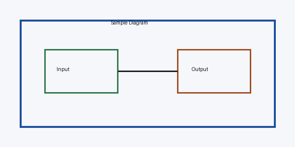

# sample_xlsx

# Sheet: Summary

| Item | Value | Notes |
| --- | --- | --- |
| Total | 100 | Sample total |
| Status | OK | Ready for review |

# Sheet: Detail

| ID | Name | Qty |
| --- | --- | --- |
| 1 | Part A | 10 |
| 2 | Part B | 15 |

# Sheet: Diagram

| Embedded diagram sample |
| --- |

---

## Conversion Notes

- Excel formulas may appear as formulas if cached calculated values are unavailable.
- Native Excel charts are not guaranteed to be extracted in this MVP.
- Embedded Excel images are extracted using openpyxl internal image access when available.
