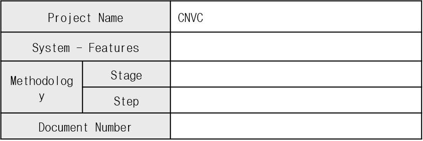
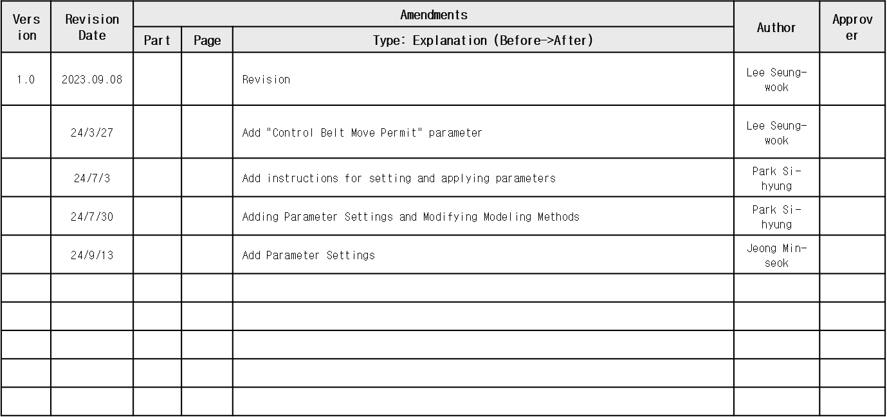
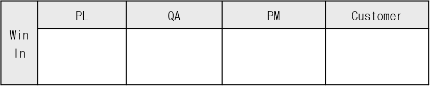

# xxxsample_docx

# xxxsample_docx

# Extracted Images

---

## Conversion Notes

- DOCX text boxes, floating objects, headers, footers, and embedded objects may require manual review.
- DOCX images are extracted from the document media package and appended to Markdown references.
